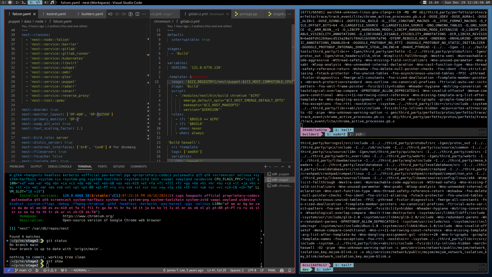

# Nest

Nest is my personal Linux distribution based on Gentoo.  You can learn more
about it at [james.tl](https://james.tl/projects/nest/).

This Puppet module defines almost all of the behavior for the distribution.  As
a personal operating system, this module is subject to change frequently and it
is not worth documenting in detail; but if you are interested in browsing the
code, it may help you to know about the structure.

Where many integration-level Puppet modules implement a kind of roles and
profiles pattern which works well for small enterprises, this module implements
my own roles and platforms pattern which, I think, maps onto the needs of an
individual computer user in a more expressive way.  For example, the current
environment understands the following roles and platforms:

| Platform        | Role        |
|-----------------|-------------|
| generic         | server      |
| beagleboneblack | workstation |
| pine64          |             |
| pinebookpro     |             |
| raspberrypi     |             |
| rock5           |             |
| sopine          |             |

So you can build a "raspberrypi workstation" or a "beagleboneblack server" or
any other combination.  These roles and platforms sit on top of a more generic
understanding of architecture such that configurations can be defined separately
for, e.g., ARM and different ARM platforms.

Beyond that, this module contains classes for a small set of
[services](https://gitlab.james.tl/nest/puppet/-/tree/main/manifests/service)
that can be applied to virtually any combination of role and platform.

This module is also a Bolt project. It is maintained with PDK.
